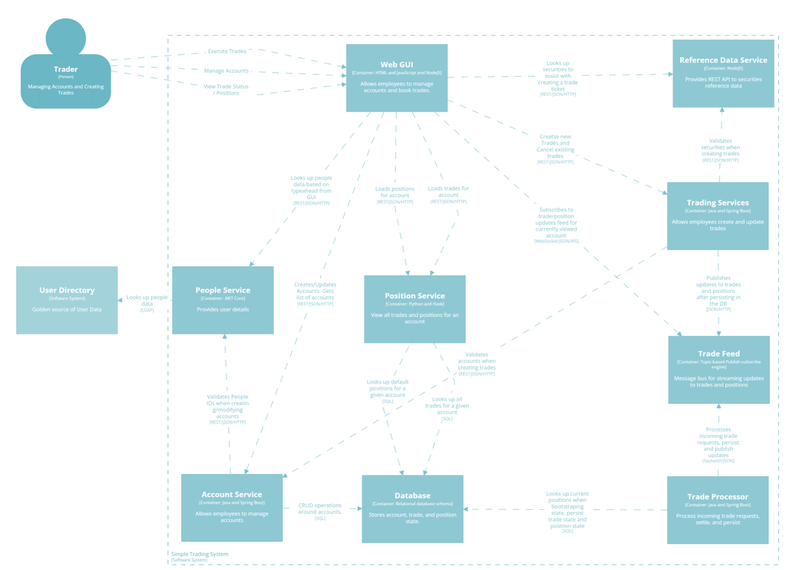

# traderx-demo

Get the [finos/traderX](https://github.com/finos/traderX) to Score and Humanitec.

[](https://codespaces.new/Humanitec-DemoOrg/traderx-demo)



## Local deployment with Docker Compose

Deploy and test locally with Docker compose:
```bash
make compose-up

make compose-test
```

## Local deployment with Kind cluster

Deploy and test locally with Kind cluster:
```bash
make kind-create-cluster

make k8s-up

make k8s-test
```

## Humanitec deployment

You will need to [install `humctl`](https://developer.humanitec.com/platform-orchestrator/cli/) locally.

Deploy to Humanitec:
```bash
export HUMANITEC_ORG=FIXME
export HUMANITEC_APPLICATION=traderx
export HUMANITEC_ENVIRONMENT=development

humctl login

humctl create app ${HUMANITEC_APPLICATION} \
    --name ${HUMANITEC_APPLICATION}

make humanitec-deploy
```

Get the generated DNS one the deployment is done:
```bash
humctl get active-resources \
    --app ${HUMANITEC_APPLICATION} \
    --env ${HUMANITEC_ENVIRONMENT} \
    -o json \
    | jq -c '.[] | select(.metadata.type | contains("dns"))' \
    | jq -r .status.resource.host
```

Here is the associated resource graph generated by Humanitec:
```bash
humctl resources graph \
    --app ${HUMANITEC_APPLICATION} \
    --env ${HUMANITEC_ENVIRONMENT}
```

